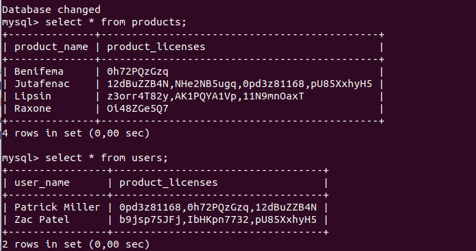
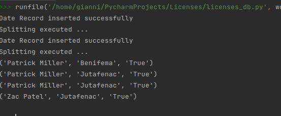

# licensesCheck

You are given two tables products and users in a MySQL database. The products table has columns product_name and product_licenses (valid licenses for this product, separated by commas). The users table has columns user_name and product_licenses (licenses that this user has, separated by commas).
Your task is to fetch information from the database and print the following info to the console: For every pair (user, product) you should print true if the user has at least one of the valid licenses for this product, and false otherwise. 

  

<figure>
  
    <figcaption> Desired output </figcaption>
</figure>

<figure>
  
    <figcaption> My achievement </figcaption>

</figure>

